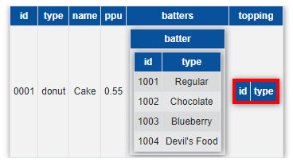

# D3JSON2TABLE

Transforms a nested json object to an HTML table with collapsible sub tables

- D3.js 3.5.17
- Bootstrap 4
- JQuery 3.5.1

## credits

From an idea by [nautat]([https://link](http://bl.ocks.org/nautat/4085017))

## Licence

[![CC BY 4.0][cc-by-shield]][cc-by]

This work is licensed under a [Creative Commons Attribution 4.0 International
License][cc-by].

[![CC BY 4.0][cc-by-image]][cc-by]

[cc-by]: http://creativecommons.org/licenses/by/4.0/
[cc-by-image]: https://i.creativecommons.org/l/by/4.0/88x31.png
[cc-by-shield]: https://img.shields.io/badge/License-CC%20BY%204.0-lightgrey.svg